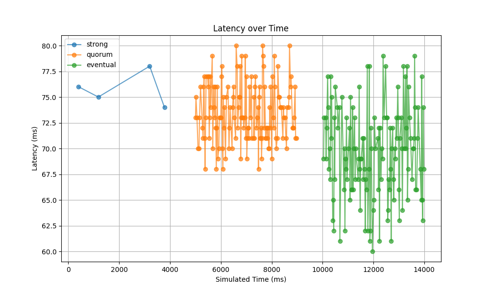
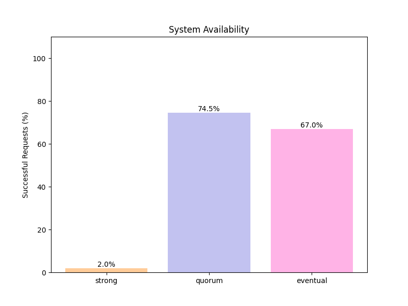
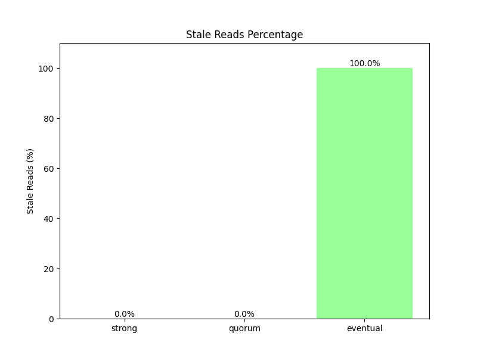
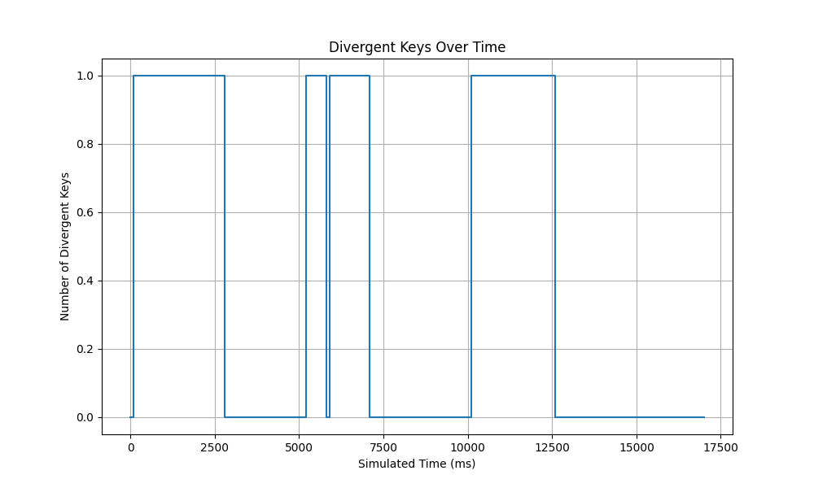

# SplitBrain: Consistency Analyzer

**Simulating how distributed systems diverge and recover under partition.**

SplitBrain is an event-driven distributed systems simulation framework that analyzes the trade-offs between **strong consistency**, **quorum-based consistency**, and **eventual consistency** under controlled network conditions.

This project is designed as a **scientific experimentation tool**, not a production system. It enables precise, reproducible experiments to understand how distributed systems behave when they **disagree (split-brain scenarios)** and how they eventually converge.

---

## Overview

In distributed systems, a *split-brain* scenario occurs when network partitions cause nodes to diverge in state. This project simulates exactly that behavior and measures how different consistency models handle it.

SplitBrain implements a replicated key-value store across multiple nodes and evaluates consistency strategies under identical workloads using:

* deterministic simulated time
* message-level network behavior
* controlled failure injection

---

## System Architecture

```text
Client Requests
      ↓
  Coordinator
      ↓
  Event-Driven Network Layer
      ↓
 Replica Nodes (3+)
```

## Core Components

* **Node**: Stores key-value data, processes incoming messages.
* **Coordinator**: Handles client requests, applies consistency logic.
* **Network Layer**: Central message router with latency injection and partitions.
* **Event Engine**: Processes events in timestamp order, advances simulated time.
* **Metrics Engine**: Logs all requests and computes metrics.

---

## Metrics Collected

| Metric               | Description                                   |
| -------------------- | --------------------------------------------- |
| **Latency**          | Time from request initiation to completion    |
| **Stale Reads (%)**  | Percentage of reads returning outdated values |
| **Availability (%)** | Successful responses / total requests         |
| **Convergence Time** | Time for replicas to reach consistency        |

---

## Usage

### Installation

First, ensure you have Python 3.11+ installed. You can install the package and its dependencies using:

```bash
pip install -e .
```

### Running the Project

SplitBrain provides a CLI (Command Line Interface) through `runner.py`.

#### 1. Run a Single Experiment

To run an experiment based on a specific configuration file:

```bash
python runner.py run-experiment --config experiments/configs/high_latency.yaml
```

This will run the simulation, output summary tables to the terminal, and generate visualization plots for all consistency models in `experiments/results/`.


#### 2. Compare Multiple Experiments

To run multiple experiments sequentially:

```bash
python runner.py compare --configs experiments/configs/config1.yaml --configs experiments/configs/config2.yaml
```


---

## Example Output

Running `python runner.py compare` across all three built-in configs produces output like this:

```
Starting experiment: high_latency (seed: 42)
Nodes: 3, Latency: 150±50ms, Drop: 0.0%

--- Results ---
   Model  Latency (mean)  Latency (p95)  Stale Reads (%)  Availability (%)
eventual         352.025         387.05              9.0             100.0
  strong         366.915         393.05              0.0             100.0
  quorum         352.215         374.00              0.0             100.0

Plots saved to experiments\results\high_latency/
----------------------------------------
Starting experiment: packet_loss (seed: 42)
Nodes: 10, Latency: 30±10ms, Drop: 20.0%

--- Results ---
   Model  Latency (mean)  Latency (p95)  Stale Reads (%)  Availability (%)
eventual       69.604478          77.35            100.0              67.0
  strong       75.750000          77.70              0.0               2.0
  quorum       73.422819          78.60              0.0              74.5

Plots saved to experiments\results\packet_loss/
----------------------------------------
Starting experiment: partition (seed: 42)
Nodes: 5, Latency: 30±5ms, Drop: 0.0%
[500ms] Partition isolated node1
[2000ms] Partition healed

--- Results ---
   Model  Latency (mean)  Latency (p95)  Stale Reads (%)  Availability (%)
eventual       65.080000           69.0              4.0             100.0
  strong       67.891975           70.0              0.0              81.0
  quorum       65.152500           67.0              0.0             100.0

Plots saved to experiments\results\partition/
```

### Key Observations
| Scenario | Winner | Reason |
|---|---|---|
| **High Latency** | Eventual (lowest latency) | Only waits for 1 ACK vs all nodes |
| **Packet Loss** | Eventual (100% availability) | Single-node ACK tolerates drops |
| **Partition** | Strong (0% stale reads) | All-node ACK guarantees freshness |

---

## Screenshots

> Plots are generated from the **packet loss** scenario (3 nodes, 20% drop rate).

### Latency Timeline


### Availability by Model


### Stale Reads by Model


### Convergence Time


---

## License

MIT License
